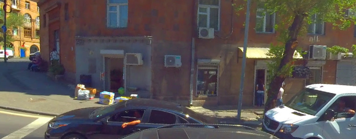
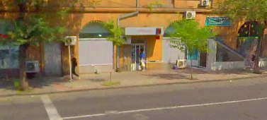
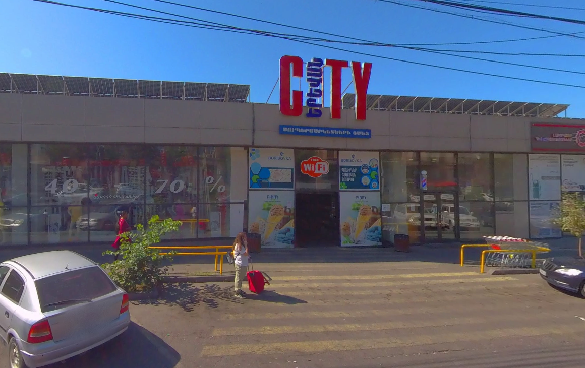
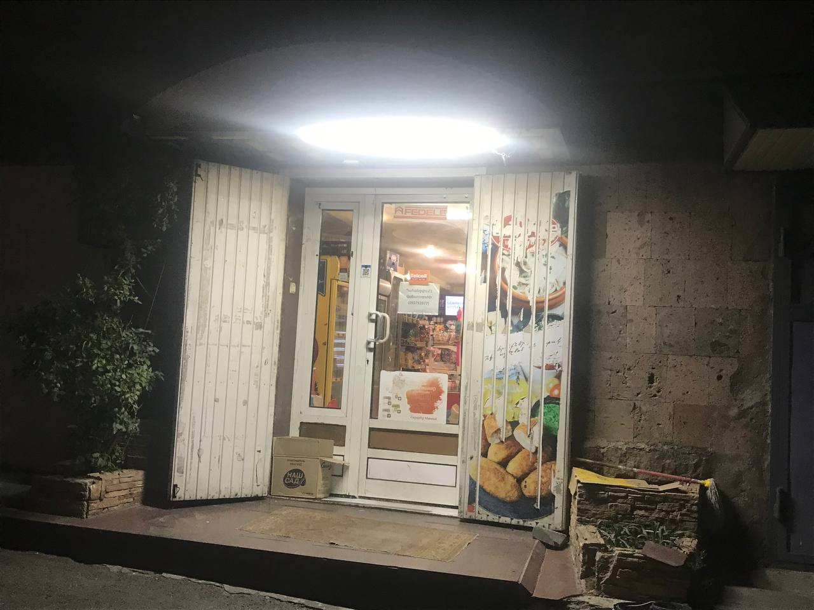

# Աշտարակ Կաթ SWOT վերլուծություն

### Ուժեղ Կողմեր (Strengths)
---
### Թույլ Կողմեր (Weaknesses)
---
### Հնարավորություններ (Opportunities)
---
### Վտանգներ (Threats)
---

## Ինֆորմացիյա

### Քարտեզներ (B2B շուկաների մասին ինֆորմացիյա)
---
#### Mtrek Խանութ

**Հասցե՝** Կիեվյան 12 Փողոց

**Աշտարակ Կաթ**՝ Չկա

---
#### Խանութ 2

**Հասցե՝** Կիեվյան 12 Փողոց

**Աշտարակ Կաթ**՝ Չկա կամ շատ քիչ քանակով

---
#### Komitas Yerevan City

**Հասցե՝** 60, 2 Komitas Ave, Yerevan

**Աշտարակ Կաթ**՝ Չկա կամ շատ քիչ քանակով դժվար գտնվող տեղերում քան Marianna-ն

---
#### Inchvor ankap Xanut Katalisti moter@

****Հասցե՝** Կատալիստ Ակադեմիյա-ի մոտակայքում (Կոնկրետ չգիտեմ)

**Աշտարակ Կաթ**՝ Չկա բայց կա լիքը Marianna-ի ապրանքներից
